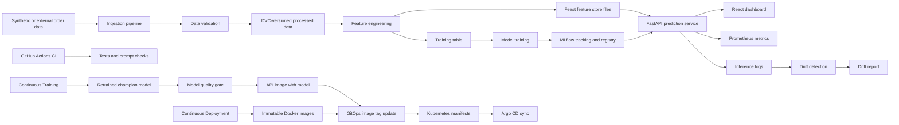

# DeliveryRisk MLOps

DeliveryRisk MLOps is a production-style learning project that predicts whether a food or grocery delivery order is likely to arrive late. It includes the complete MLOps lifecycle: data ingestion, validation, versioning, feature engineering, a feature store, model training, experiment tracking, a model registry, API serving, frontend dashboard, Docker, Kubernetes, GitHub Actions, Argo CD, monitoring, drift detection, and Promptfoo prompt testing.

The project uses synthetic data by default so you can run everything without external data contracts or paid APIs. The code is intentionally realistic: the same architecture can be adapted to real order, courier, traffic, weather, and merchant data.

## What You Will Build

- A reproducible ML pipeline with DVC.
- Data quality checks before training.
- Feature engineering that writes both training features and Feast feature-store inputs.
- A scikit-learn model tracked in MLflow and registered as a candidate model.
- A FastAPI service for real-time prediction.
- A React operations dashboard.
- Prometheus-ready API metrics and a drift detection service.
- Docker Compose for local development.
- Kubernetes manifests and Argo CD GitOps deployment.
- GitHub Actions for CI, Docker build, Continuous Deployment, Continuous Training, and Promptfoo prompt regression tests.

## Architecture



## Tool Map

| Capability | Tool in this project |
| --- | --- |
| Data ingestion | Python and pandas |
| Data validation | Python data contracts in `pipelines/validate.py` |
| Data versioning | DVC |
| Feature engineering | pandas |
| Feature store | Feast |
| Model training | scikit-learn |
| Experiment tracking | MLflow Tracking |
| Model registry | MLflow Model Registry |
| Backend | FastAPI |
| Frontend | React and Vite |
| Dockerization | Docker and Docker Compose |
| Kubernetes | Kustomize manifests |
| CI/CD | GitHub Actions |
| Continuous Training | Scheduled/manual GitHub Actions plus DVC and MLflow |
| GitOps CD | Argo CD |
| Monitoring | Prometheus and Grafana configs |
| Drift detection | Custom PSI and KS-style checks in `services/monitoring` |
| Prompt testing | Promptfoo |

## Quick Start

```powershell
python -m venv .venv
.\.venv\Scripts\Activate.ps1
python -m pip install --upgrade pip
pip install -r requirements.txt

python -m pipelines.ingest
python -m pipelines.validate
python -m pipelines.features
python -m pipelines.train

uvicorn services.api.app.main:app --reload --port 8000
```

Open the API docs at `http://localhost:8000/docs`.

In another terminal:

```powershell
cd services/frontend
npm install
npm run dev
```

Open the frontend at `http://localhost:5173`.

## Docker Compose

```powershell
docker compose up --build
```

Services:

- API: `http://localhost:8000`
- Frontend: `http://localhost:5173`
- MLflow: `http://localhost:5000`
- Prometheus: `http://localhost:9090`
- Grafana: `http://localhost:3000`
- Drift service: `http://localhost:8010`

## Learning Path

Start with [docs/EXECUTION_RUNBOOK.md](docs/EXECUTION_RUNBOOK.md). It tells you exactly where to run every command: VS Code terminal, browser, Docker Desktop, GitHub Actions, Kubernetes, and Argo CD.

Then use [docs/STEP_BY_STEP_GUIDE.md](docs/STEP_BY_STEP_GUIDE.md). It explains every stage in beginner-friendly terms.

Use [docs/ARCHITECTURE.md](docs/ARCHITECTURE.md) when you want the senior-engineer view of why each component exists.

Use [docs/RESUME.md](docs/RESUME.md) when preparing interviews or portfolio descriptions.

## Official References

- [DVC pipelines](https://dvc.org/doc/user-guide/pipelines)
- [Feast feature store](https://feast.dev/)
- [MLflow Tracking](https://mlflow.org/docs/latest/ml/tracking/)
- [MLflow Model Registry](https://mlflow.org/docs/2.11.1/model-registry.html)
- [GitHub Actions workflow syntax](https://docs.github.com/actions/reference/workflows-and-actions/workflow-syntax)
- [Argo CD](https://argo-cd.readthedocs.io/)
- [Promptfoo CI/CD](https://www.promptfoo.dev/docs/integrations/ci-cd/)
