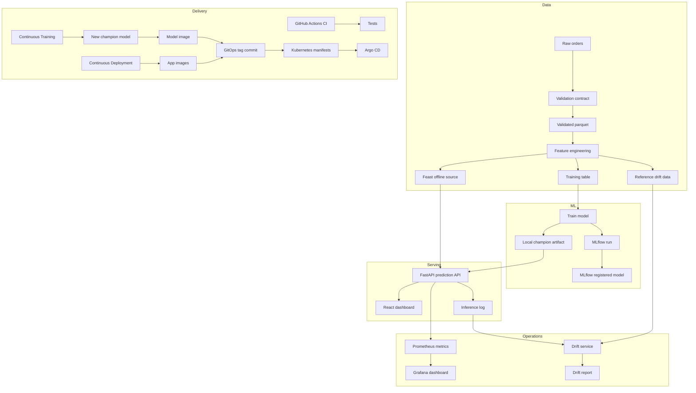

# Architecture

## Product Idea

DeliveryRisk MLOps predicts whether an active delivery order is likely to miss its promised arrival time. The user is an operations analyst who wants to decide whether to notify the customer, reassign a courier, or simply monitor the order.

The project is intentionally scoped around one model and one real-time API because this is the cleanest way to learn the full lifecycle without drowning in platform complexity.

## System Components

## Why Each Tool Exists

| Tool | Why it is here |
| --- | --- |
| DVC | Reproduces the ML pipeline and versions data outputs outside normal Git blobs. |
| Feast | Defines reusable online/offline features so training and serving can share feature logic. |
| MLflow | Tracks experiments, parameters, metrics, artifacts, and registered models. |
| FastAPI | Serves predictions through a typed HTTP interface. |
| React | Gives a portfolio-ready product surface instead of a notebook-only demo. |
| Prometheus | Scrapes API metrics such as request count and latency. |
| Grafana | Visualizes operational metrics. |
| Drift service | Compares current inference traffic against training reference distributions. |
| Docker | Packages services consistently. |
| Kubernetes | Runs services with replicas, health probes, services, and ingress. |
| GitHub Actions | Automates linting, tests, pipeline smoke checks, prompt tests, and image builds. |
| Continuous Training workflow | Retrains on schedule or manual trigger, checks model quality, packages the promoted model, and updates the dev GitOps tag. |
| Argo CD | Continuously reconciles Kubernetes state from Git. |
| Promptfoo | Regression-tests the operations-assistant prompt before changes are shipped. |

## Environments

Local development uses Docker Compose. It is good for quick feedback.

Kubernetes development uses `k8s/overlays/dev`. It uses fewer replicas and latest images.

Kubernetes production uses `k8s/overlays/prod`. It increases replicas and is where you would add stricter resource limits, secrets, autoscaling, network policies, and persistent storage.

## Production Hardening Checklist

- Replace local files with object storage such as S3, GCS, or Azure Blob.
- Use a remote DVC store instead of local data directories.
- Use PostgreSQL for MLflow backend metadata and S3-compatible storage for artifacts.
- Store secrets in a managed secret store, not plain Kubernetes YAML.
- Add resource requests and limits to every deployment.
- Add authentication to the API and dashboard.
- Use a real ingress controller with TLS.
- Add a feature store online backend such as Redis.
- Add model approval gates before promoting a model alias to production.
- Add alert routing for drift, high latency, and error rate.
